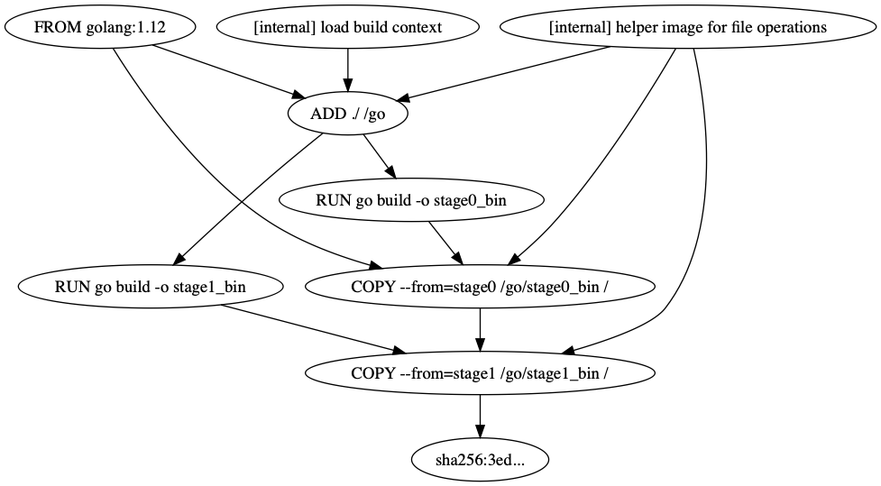

# llb2dot

 [](https://circleci.com/gh/po3rin/llb2dot) [](https://golangci.com) <a href="https://codeclimate.com/github/po3rin/llb2dot/maintainability"></a>

llb2dot package lets you to convert BuildKit LLB to dot language to analize. You also can directly load Dockerfile.



## Installation

from here
https://github.com/po3rin/llb2dot/releases

## Usage

convert llb to dot language using Dockerfile.

```bash
$ lb2dot -f ./Dockerfile
```

vizualize llb using dot cli.

```bash
$ llb2dot -f ./Dockerfile |  dot -T png -o result.png
```

also, you directory generate dot language from llb using l flag.

```bash
$ go run cmd/_testplainllb/main.go | llb2dot -l
```

As code

```go
package main

import (
	"os"

	"github.com/po3rin/llb2dot"
)
func main(){
    // load llb (you want to load from Dockerfile? use LoadDockerfile)
    ops, _ := llb2dot.LoadLLB(os.Stdin)

    // convert graph
    g, _ := llb2dot.LLB2Graph(ops)

    // write graph as dot language
    llb2dot.WriteDOT(os.Stdout, g)
}

```

## Contributing

You're most welcomed! Welcome pull request and issues.
